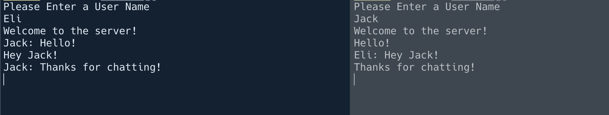

# Socket Chat
Socket Chat is a terminal based Chat app. It utilizes WebSockets to handle the communication between each user instance. The reason for building this little project was to understand how WebSockets work. Inevitably it also required me to explore topics such as threading and multiprocessing and allowed me to learn about the GIL and its pros and cons. 

## Features

- Listening Socket: The listening socket acts like a server that handles each user message and transmits them to the rest of the chat accordingly.
- Multi Connection: Socket Chat allows for multiple users to join the server and participate in chatting.

## Future Enhancements

- Text Decoration and Styling
- User to User chatting

